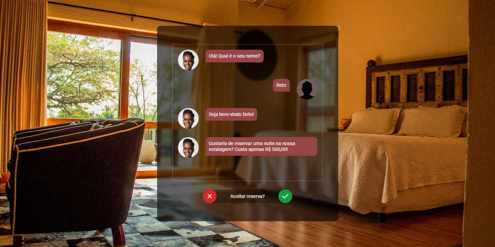

<div align="center">
  
</div>
<h1 align="center">
  Chatbot de Hospedagem
</h1>
<p align="center">
  É um <a href="https://jonathanbenedito.github.io/chat-bot-hospedagem/" target="_blank">website</a> que contém um pequeno chatbot, ele faz perguntas ao usuário sobre seu nome e se ele gostaria de fazer uma reserva. Hospedado no <a href="https://pages.github.com/">GitHub Pages</a>.
</p>




## 🛠 Guia de instalação

1. Faça o clone do projeto
    ```
    git clone https://github.com/jonathanBenedito/chat-bot-hospedagem.git
    ```

2. Acesse o repositório
    ```
    cd chat-bot-hospedagem
    ```

### 🖼 Fotos (Mobile)

|   |  |
|:---:|:---:|
| Smartphone layout | Demonstração

### 🔗 Links

Website: <a href="https://jonathanbenedito.github.io/chat-bot-hospedagem/" target="_blank">jonathanbenedito.github.io/chat-bot-hospedagem/</a>

### 🧱 Tecnologias

O website foi construído usando HTML 5, CSS 3 e Javascript.

<div style="display: flex; margin-top: 15px; gap: 20px;">
  
  
          
</div>
